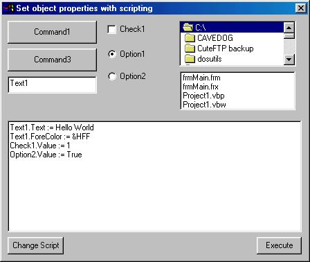



## Set object properties w/ CallByName

### Description

Uses CallByName to set properties of objects. Could be used in a scripting engine.
 
### More Info
 

             |
---                |---
**Submitted On**   |2001-04-18 18:36:52
**By**             |[Raizer](https://github.com/Planet-Source-Code/PSCIndex/blob/master/ByAuthor/raizer.md)
**Level**          |Intermediate
**User Rating**    |5.0 (10 globes from 2 users)
**Compatibility**  |VB 6\.0
**Category**       |[Coding Standards](https://github.com/Planet-Source-Code/PSCIndex/blob/master/ByCategory/coding-standards__1-43.md)
**World**          |[Visual Basic](https://github.com/Planet-Source-Code/PSCIndex/blob/master/ByWorld/visual-basic.md)
**Archive File**   |[Set object186314212001\.zip](https://github.com/Planet-Source-Code/raizer-set-object-properties-w-callbyname__1-22573/archive/master.zip)

